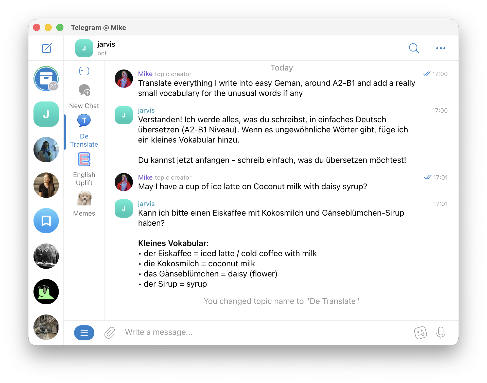

# KiroClaw

> ✅ **Multi-user security hardening complete.** This bot now implements per-user session isolation with defense-in-depth protections. See [Security](#security) section for details.

Telegram bot that connects [Kiro CLI](https://kiro.dev/docs/cli/) via the Agent Client Protocol (ACP) to a threaded Telegram bot. Each forum thread gets its own Kiro session with full conversation history, file exchange, and streaming responses.

Use cases:
- On-the-go translation with full conversation memory
- File analysis — send documents, images, or audio and get structured responses (if you have tools to process them)
- Coding assistance from your phone — same Kiro agent, just over Telegram

Built-in capabilities (inherited from Kiro CLI's default agent):
- Upload files to the bot and get processed results back as files or text
- Bidirectional file exchange — the agent can create and send files to you
- Add custom skills in the [Agent Skill format](https://agentskills.io/specification)
- Steering files for shaping agent behavior per deployment
- Model selection per thread (`/model`) — switch between Claude variants on the fly
- Full conversation memory within each thread
- **Per-user session isolation** — users cannot access each other's conversations or files



## Prerequisites

- Python 3.12
- [uv](https://docs.astral.sh/uv/) package manager
- [kiro-cli](https://kiro.dev/docs/cli/) installed and on PATH
- A Telegram bot token (from [@BotFather](https://t.me/BotFather))
- A Telegram bot with threads enabled

### BotFather Setup

1. Create a bot via [@BotFather](https://t.me/BotFather) (`/newbot`)
2. Enable threaded mode: BotFather → your bot → Bot Settings → Threads Settings → Threaded Mode On


## Installation

```bash
git clone https://github.com/umaxfun/kiroclaw
cd kiroclaw
uv sync
```

## Configuration

Copy `.env.example` to `.env` and fill in the values:

```bash
cp .env.example .env
```

| Variable | Required | Default | Description |
|----------|----------|---------|-------------|
| `BOT_TOKEN` | Yes | — | Telegram bot token |
| `KIRO_AGENT_NAME` | Yes | tg-acp | Do not modify it unless you are certain of what you are doing |
| `ALLOWED_TELEGRAM_IDS` | No | _(empty)_ | Comma-separated Telegram user IDs allowed to use the bot. Empty = nobody allowed (fail-closed) |
| `KIRO_CONFIG_PATH` | No | `./kiro-config/` | Path to the agent config template directory |
| `WORKSPACE_BASE_PATH` | No | `./workspaces/` | Base directory for per-user/thread workspaces |
| `MAX_PROCESSES` | No | `5` | Max kiro-cli processes in the pool |
| `IDLE_TIMEOUT_SECONDS` | No | `30` | Seconds before killing idle extra processes |
| `LOG_LEVEL` | No | `INFO` | `DEBUG`, `INFO`, `WARNING`, or `ERROR` |

### Getting your Telegram ID

Deploy with `ALLOWED_TELEGRAM_IDS` empty, then message the bot. It will reply with your numeric Telegram ID. Add that ID to `.env` and restart.

## Kiro Agent Setup

The `kiro-config/` directory contains the agent template that gets provisioned to `~/.kiro/` on first run:

```
kiro-config/
├── agents/       # Agent config JSON (must contain {KIRO_AGENT_NAME}.json)
├── skills/       # Kiro skills
└── steering/     # Steering files for agent behavior
```

The bot copies this to `~/.kiro/` at startup if not already present. The agent config defines the model, tools, and steering that kiro-cli uses when responding.

## Running

```bash
uv run main.py
```

The bot will:
1. Validate prerequisites (kiro-cli, agent config, workspace directory)
2. Provision `~/.kiro/` from the template (first run only)
3. Initialize the process pool
4. Start polling Telegram for messages

## Bot Commands

| Command | Description |
|---------|-------------|
| `/start` | Welcome message (shows your Telegram ID if access is restricted) |
| `/model` | List available models or set one for the current thread (`/model claude-sonnet-4`) |

## Architecture

```
Telegram ──> Bot Handlers (C6)
                 │
                 ├── Config (C7) ─── .env
                 ├── Session Store (C3) ─── SQLite (tg-acp.db)
                 ├── Process Pool (C2) ─── kiro-cli processes
                 │       └── ACP Client (C1) ─── stdin/stdout JSON-RPC
                 ├── Stream Writer (C5) ─── chunked Telegram messages
                 ├── File Handler (C4) ─── bidirectional file transfer
                 └── Workspace Provisioner (C8) ─── ~/.kiro/ setup
```

Each forum thread maps to one Kiro session. The process pool manages kiro-cli instances with thread affinity, idle reaping, and request queuing when all slots are busy.

## Security

KiroClaw implements defense-in-depth security for multi-user deployments. See [SECURITY_PROPOSAL.md](SECURITY_PROPOSAL.md) for the complete security architecture.

### Multi-User Isolation

**Per-User Session IDs**: All session IDs are prefixed with `user-{telegram_user_id}-` to prevent cross-user access. The SessionStore validates ownership on every operation.

**Process Pool Isolation**: Each kiro-cli process is bound to a single user. Processes are never shared across users, preventing:
- Cross-user session access
- Process memory leakage
- Cached state contamination

**Session Affinity**: The `(user_id, thread_id)` tuple ensures threads always return to the same process that holds their session lock, while enforcing per-user boundaries.

**Workspace Isolation**: Each user gets isolated workspace directories with path validation to prevent traversal attacks:
```
./workspaces/
  ├── {telegram_user_id}/
  │   ├── {thread_id_1}/
  │   └── {thread_id_2}/
```

### Access Control

**Fail-Closed by Default**: The `ALLOWED_TELEGRAM_IDS` environment variable must be explicitly set. Empty = nobody allowed.

**User Allowlist**: Only Telegram user IDs in the allowlist can use the bot. All requests are validated before processing.

### Session Security

**Ownership Validation**: 
- SessionStore validates session ownership on every `get_session()` call
- `upsert_session()` rejects sessions with incorrect user prefixes
- Prevents session hijacking and enumeration attacks

**Session ID Format**: `user-{telegram_user_id}-{kiro_generated_id}`
- Example: `user-123456-sess_abc123`
- User ID is extracted and validated on every operation

### Best Practices for Deployment

1. **Set ALLOWED_TELEGRAM_IDS**: Deploy with empty list first, get your ID, then add it
2. **Use Environment Variables**: Never commit `.env` file to version control
3. **Monitor Logs**: Review logs for unauthorized access attempts
4. **Per-User Limits**: Consider setting `MAX_PROCESSES_PER_USER` in production
5. **Workspace Permissions**: Ensure workspace directories have appropriate file permissions

### Security Limitations

**System-Level Isolation**: All users share the same system user account. For stronger isolation, consider:
- Running in separate containers per user
- Using filesystem quotas
- Implementing rate limiting

**Session Storage**: Sessions are stored in `~/.kiro/sessions/cli/` on the host. For production:
- Use encrypted storage
- Implement session expiration
- Add audit logging

See [SECURITY_PROPOSAL.md](SECURITY_PROPOSAL.md) for implementation details and future enhancements.
