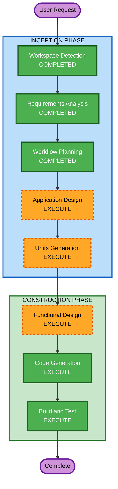

# Execution Plan

## Detailed Analysis Summary

### Change Impact Assessment
- **User-facing changes**: Yes — new Telegram bot with streaming responses, file handling, model selection
- **Structural changes**: Yes — new system with multiple async components (bot, ACP client, process pool, session manager)
- **Data model changes**: Yes — SQLite schema for session mapping and model selection
- **API changes**: N/A — no external APIs exposed, bot consumes Telegram Bot API and Kiro ACP
- **NFR impact**: Yes — process pool sizing, idle timeouts, streaming performance

### Risk Assessment
- **Risk Level**: Medium — multiple async components interacting, subprocess management, streaming protocol
- **Rollback Complexity**: Easy — greenfield, no existing system to break
- **Testing Complexity**: Moderate — requires real kiro-cli and real Telegram bot for integration tests

## Workflow Visualization



### Text Alternative
```
INCEPTION PHASE:
  1. Workspace Detection    — COMPLETED
  2. Requirements Analysis  — COMPLETED
  3. User Stories           — SKIPPED (single user type, requirements sufficient)
  4. Workflow Planning      — COMPLETED
  5. Application Design    — EXECUTE
  6. Units Generation      — EXECUTE

CONSTRUCTION PHASE (per unit):
  7. Functional Design     — EXECUTE
  8. NFR Requirements      — SKIP
  9. NFR Design            — SKIP
  10. Infrastructure Design — SKIP
  11. Code Generation       — EXECUTE
  12. Build and Test        — EXECUTE
```

## Phases to Execute

### INCEPTION PHASE
- [x] Workspace Detection (COMPLETED)
- [x] Reverse Engineering (SKIPPED — Greenfield)
- [x] Requirements Analysis (COMPLETED)
- [x] User Stories (SKIPPED)
  - **Rationale**: Single user type (Telegram user), requirements already capture all interactions clearly
- [x] Workflow Planning (COMPLETED)
- [ ] Application Design — EXECUTE
  - **Rationale**: Multiple new components needed (ACP client, process pool, session manager, bot handlers, file handler). Component boundaries, responsibilities, and interactions need definition before coding
- [ ] Units Generation — EXECUTE
  - **Rationale**: System decomposes into distinct units that should be built and tested incrementally per the user's requirement. Units need explicit ordering to match the incremental testability approach

### CONSTRUCTION PHASE
- [ ] Functional Design — EXECUTE (per unit)
  - **Rationale**: Each unit has business logic that benefits from upfront design — ACP protocol state machine, process pool lifecycle, streaming accumulation, cancel semantics, file parsing
- [ ] NFR Requirements — SKIP
  - **Rationale**: NFRs already captured in requirements (NFR-01 through NFR-05). Tech stack decided. No additional NFR analysis needed
- [ ] NFR Design — SKIP
  - **Rationale**: NFR Requirements skipped, no NFR patterns to incorporate
- [ ] Infrastructure Design — SKIP
  - **Rationale**: PoC runs locally, no cloud infrastructure. Deployment is out of scope
- [ ] Code Generation — EXECUTE (per unit, always)
  - **Rationale**: Implementation needed
- [ ] Build and Test — EXECUTE (always)
  - **Rationale**: Integration test instructions needed for all 4 test layers

### OPERATIONS PHASE
- [ ] Operations — PLACEHOLDER

## Success Criteria
- **Primary Goal**: Working Telegram bot that streams Kiro CLI responses in real-time via sendMessageDraft
- **Key Deliverables**: Bot application code, SQLite session store, steering file for file sending, integration tests
- **Quality Gates**: Each unit passes its integration tests before the next unit is built
